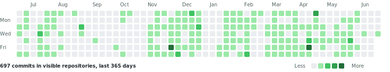

# 霞客湾 SHARK 机器人俱乐部

我们是来自江南大学霞客湾校区的 RoboMaster 机器人战队，围绕电控、视觉、机械、嵌入式、上位机与赛事工程化持续建设代码资产。

<!--
配图建议 6：
1. 将战队 GitHub 组织团队页面截图放到 profile/assets/github-team.png。
2. 将代码库列表截图放到 profile/assets/github-repos.png。
3. 若加入截图，可在下方取消图片注释：
   
   
-->

## 当前概览

| 指标 | 数据 |
| --- | ---: |
| 队员 / 组织成员 | 24 |
| 维护项目 | 43 |
| 公开项目 | 10 |
| 近一年可见提交 | 697 |
| 最近活跃公开项目 | rm-monitor-2026 |

## 技术方向

`C / Docs / Python / Vue / C++ / HTML`

重点沉淀方向包括机器人电控框架、飞镖系统、哨兵/步兵/英雄机器人代码、雷达与视觉、工程机器人控制、自定义客户端、赛事数据工具与队内新人教程。

## 近期活跃公开项目

| 项目 | 简介 | 语言 | Stars | 最近推送 |
| --- | --- | --- | ---: | --- |
| [rm-monitor-2026](https://github.com/JNU-SHARK/rm-monitor-2026) | 项目仓库 | Docs | 0 | 2026-06-02 |
| [SharkClient](https://github.com/JNU-SHARK/SharkClient) | Rust重构版本自定义客户端 | Vue | 8 | 2026-05-21 |
| [target-rack-system](https://github.com/JNU-SHARK/target-rack-system) | RoboMaster靶架系统固件实现 | C | 0 | 2026-04-24 |
| [SharkClientVue](https://github.com/JNU-SHARK/SharkClientVue) | 项目仓库 | Vue | 3 | 2026-04-23 |
| [RMUC2026-Registration-Dashboard](https://github.com/JNU-SHARK/RMUC2026-Registration-Dashboard) | 项目仓库 | Python | 0 | 2026-04-13 |
| [SharkDataSever](https://github.com/JNU-SHARK/SharkDataSever) | 用于测试Robomaster自定义客户端MQTT和UDP数据接收&处理的模拟服务器 | JavaScript | 29 | 2026-04-08 |
| [SHARK-Encoder](https://github.com/JNU-SHARK/SHARK-Encoder) | 项目仓库 | C | 0 | 2026-04-07 |
| [JNU-SHARK.github.io](https://github.com/JNU-SHARK/JNU-SHARK.github.io) | 项目仓库 | HTML | 0 | 2025-12-05 |

## Commit 活跃历史

## 快速入口

[组织主页](https://github.com/JNU-SHARK) · [公开仓库](https://github.com/orgs/JNU-SHARK/repositories) · [战队网站](https://JNU-SHARK.github.io)

---

Last updated: 2026-06-17 Asia/Shanghai. Commit heatmap and public repository table are generated from GitHub API.
